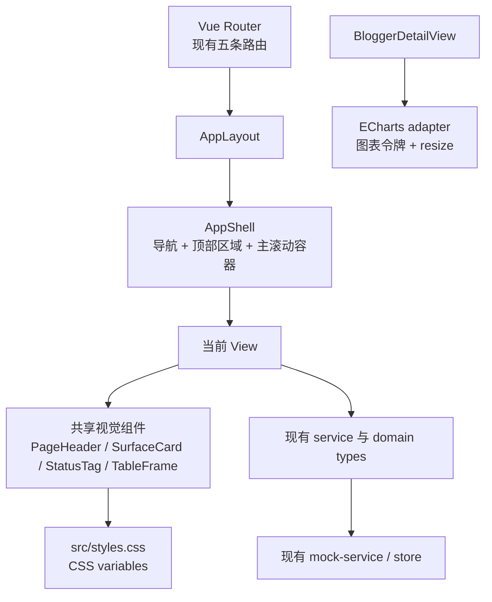

# Fund Lens 视觉改版技术设计

## Overview

### 1.1 目标

本设计把已确认的视觉需求落地为一套适用于 Fund Lens 五类页面及博主详情的呈现层规范。目标是借鉴参考图的留白、分组、字体层级、间距和低对比度阴影原则，形成克制的研究工作台，而不是复制参考图的品牌、文案、图形或逐像素布局。

设计遵循以下边界：

- 保留 Vue 3、Vue Router、Element Plus 和 ECharts 技术栈。
- 保留 `/`、`/bloggers/:id`、`/import`、`/history`、`/settings` 路由及现有页面信息架构。
- 保留 `src/services/`、`src/types/` 的业务数据契约、筛选语义、收益颜色语义、OCR 审核和设置管理行为。
- 只调整视觉令牌、布局、组件组合、状态呈现和可访问性，不改变收益、回撤、重复判断或确认提交规则。

### 1.2 研究与现状结论

设计基于仓库现状完成，而非假设新增业务层：

1. `src/components/AppShell.vue` 是所有路由共用的 Shell，负责侧边栏、页面标题、演示提示和主滚动容器。
2. `src/router/index.ts` 已把五条路由包在 `AppLayout` 下，博主详情通过 `/bloggers/:id` 进入，Shell 需要把该路由映射回总览选中态。
3. `src/types/domain.ts` 定义 `BloggerSummary`、`BloggerDetail`、`Position`、`Operation`、`ParsedOcrRecord` 等现有字段；`src/services/types.ts` 定义查询、识别、确认和维护接口。视觉组件不得重新解释这些字段。
4. `src/styles.css` 已有 `--ink`、`--muted`、`--line`、`--surface`、`--canvas`、`--navy`、`--green`、`--red`、`--amber`，本设计将其作为兼容的令牌源，并补充间距、字体、半径、焦点和阴影令牌。
5. 详情页的图表由 ECharts 在 `BloggerDetailView.vue` 中初始化；图表主题应从 CSS/TS 令牌映射生成，不能在视图中散落新的业务色值。
6. 当前自动化基线为 Vitest：5 个测试文件、9 个测试通过；`docs/demo-qa.md` 和现有 `fund2-qa-*.png` 提供构建、业务回归和视觉核对的基线。

### 1.3 设计原则

- **数据优先**：卡片和装饰服务于比较、审核和追溯；不使用大面积渐变、营销式插画或高饱和色块。
- **稳定优先**：加载、筛选、打开抽屉和提交不会让标题、筛选区或主卡片突然跳动。
- **语义优先**：正负收益仍按 A 股约定表达，状态同时使用文字、图标/形状或边框，不依赖单一颜色。
- **共享优先**：页面只能组合共享 Shell、页面头部、卡片、状态、表格容器和反馈组件；页面局部样式仅处理真正特殊的业务内容。

## Architecture

### 2.1 分层



### 2.2 渲染与业务边界

- `AppShell` 只负责路由标题映射、导航可操作性、滚动容器和全局演示状态；不直接读取或变换业务数据。
- 每个 View 保留现有 `service` 调用、筛选对象、表单规则和事件处理；页面改版通过共享组件 props/slots 改变呈现。
- 共享组件接收已准备好的显示数据或业务类型，不在组件内部计算收益、确认数量、重复规则或服务请求。
- ECharts 通过一个轻量 `chartTheme`/配置工厂消费视觉令牌，图表生命周期仍由详情页负责；视口变化只触发 `resize`，不改变图表数据。
- Element Plus 仍负责表格、表单、标签、抽屉、对话框和基础交互；全局 CSS 用令牌覆盖其视觉变量，避免为每个页面复制实现。

### 2.3 滚动与尺寸契约

`.app-shell` 保持 `min-height: 100dvh`；`.main-frame` 必须 `min-width: 0`；`.content-area` 是唯一主要页面滚动容器。所有网格子项使用 `minmax(0, 1fr)`，表格由自身 `.el-table__body-wrapper`/表格外层容器承担横向滚动。不得在 Shell、页面和表格外层同时设置互相竞争的 `overflow-x: auto`。

### 2.4 视觉令牌

令牌写入 `src/styles.css`，保留现有业务色令牌名称；新组件不得直接写页面专属色值。

```css
:root {
  --ink: #172033;
  --muted: #7c879a;
  --line: #e6eaf1;
  --surface: #ffffff;
  --canvas: #f4f6fa;
  --navy: #10263f;
  --green: #0d8b67; /* 负收益/下行 */
  --red: #d45d5d;   /* 正收益/上行 */
  --amber: #c18b3c; /* 警告/疑似重复 */
  --blue: #2a6f8f;
  --focus: #3f7ea0;
  --on-navy: #eef4fa;

  --space-1: 4px;
  --space-2: 8px;
  --space-3: 12px;
  --space-4: 16px;
  --space-5: 20px;
  --space-6: 24px;
  --space-8: 32px;
  --space-10: 40px;
  --space-12: 48px;

  --radius-sm: 6px;
  --radius-md: 10px;
  --radius-pill: 999px;
  --shadow-card: 0 4px 14px rgb(29 49 76 / 3%);
  --shadow-overlay: 0 16px 40px rgb(16 38 63 / 14%);
  --focus-ring: 0 0 0 3px rgb(63 126 160 / 26%);
}
```

颜色角色：画布使用暖灰白，内容表面使用白色，导航使用深海军蓝，辅助操作使用低饱和蓝色，边界使用冷灰，警告只使用琥珀。收益/回撤显示沿用 `valueTone`：正值 `--red`，负值 `--green`，零值和 `null` 为 `--muted`；数值之外仍保留 `--` 和“观察期中”。

类型层级：页面标题 28px/1.25、区块标题 15–16px/1.4、正文 14px/1.6、辅助文本 12px/1.5、表格 13px/1.5、关键数字 24–28px/1.2。标题和主要指标可使用现有 Georgia/宋体回退，控件、表格和辅助文本使用系统无衬线；字体不以颜色代替层级。

间距以 4px 为基准。卡片统一 `--radius-md`、1px `--line` 边框和 `--shadow-card`；输入、状态标签和小面板使用 `--radius-sm`；避免同时使用多种阴影和大圆角。动效仅用于颜色、阴影和面板过渡，时长建议 150–200ms，并尊重 `prefers-reduced-motion`。

## Components and Interfaces

### 3.1 Shell 与导航

`AppShell` 继续作为唯一页面外壳，建议将其内部视觉职责拆成可复用的呈现片段，但不改变公开业务接口：

- `AppShell`：保留 `menuItems` 和现有 `router.push` 行为；用 `activePath` 将 `/bloggers/:id` 映射为 `/`。导航按钮保留真实 `<button>` 语义、可见文本和 `aria-current="page"`。
- `BrandBlock`：展示 `Fund Lens`、`博主追踪台` 和 F 标识；移动端隐藏文字时给标识补充 `aria-label="Fund Lens，博主追踪台"`。
- `SidebarNav`：桌面显示图标与文字，中等屏显示完整导航但缩短栏宽，窄屏显示图标导航；窄屏通过 `title`/`aria-label` 保留可识别名称，不依赖悬停才能完成操作。
- `PageHeader`：由路由状态提供标题、统一路径提示和“数据仅供演示”；详情路由显示“博主详情”并保留页面内返回总览入口。它不从业务服务加载数据。
- `FeedbackRegion`：承载页面级成功、错误、警告和确认提示；Element Plus Message/MessageBox 可作为实现，但位置、层级和文案结构统一。

导航状态：默认使用低对比文字；悬停提高文字和背景对比；聚焦使用 `--focus-ring`；选中使用 `#203b57` 背景、`--on-navy` 文字和 3px 内侧薄荷色边缘；禁用时保留文字可读性并提供原因。不要仅通过颜色表示当前项。

### 3.2 页面共享组件

建议新增或整理以下呈现组件，优先消费 CSS 令牌：

| 组件 | 主要接口/插槽 | 责任边界 |
| --- | --- | --- |
| `PageHeader` | `title`, `description`, `actions` | 页面标题、说明和主操作的稳定占位，不访问服务 |
| `SurfaceCard` | `heading`, `meta`, `actions`, default slot | 统一卡片边界、标题区、内边距和加载高度 |
| `MetricCard` | 保留 `label`, `value`, `tone` | 只显示已格式化指标；不计算业务数据 |
| `FilterBar` | 表单 slot、`loading`、`actions` | 统一筛选卡片布局，窄屏转单列；保留原表单控件与提交事件 |
| `TableFrame` | `title`, `count`, default slot, `empty` | 固定表头区域、加载/空状态空间和内部横向滚动 |
| `StatusTag` | `status`, `label`, `tone`, `icon` | 文字 + 色彩 + 可选图标表达状态；不改变领域状态值 |
| `FeedbackRegion` | `kind`, `title`, `description`, `action` | 页面级成功、错误、警告、确认前提示 |
| `ResponsiveDialog` | Element Plus dialog props/slots | 统一 `max-width`、窄屏宽度、内部滚动和焦点返回 |

`BloggerStatusTag`、OCR 审核标签和操作审核标签可复用 `StatusTag` 的样式契约，但保留已有领域文案：已达标、观察期中、未开始、待处理、已接受、已拒绝、疑似重复。`EmptyState` 需要支持说明和下一步 action slot，默认仍可显示“暂无符合条件的记录”。

表格组件 `PositionTable`、`OperationTable`、`OcrReviewTable` 只统一外壳和状态样式，不变更列、字段、排序或操作事件；所有表格外层允许在窄屏内部滚动。金额、百分比和方向色必须继续通过现有 formatter/valueTone 生成。

### 3.3 总览页面结构

```text
PageHeader（追踪池概览 + 说明 + 导入截图）
  └─ MetricGrid（总博主数 / 正式观察 / 观察期中 / 平均收益率）
  └─ SurfaceCard(FilterBar)
  └─ TableFrame（博主列表 + 数量 + 加载骨架/空状态）
```

保持 `OverviewView` 的 `filters`、`load()`、`service.listBloggers()` 和四项计算逻辑。筛选表单在宽屏为一行或可换行的紧凑布局，中等屏按可用宽度换行，窄屏为单列；“清除筛选”和“导入截图”作为空状态的明确下一步。列表详情按钮继续 `router.push('/bloggers/:id')`。

加载时 TableFrame 保留标题、列宽和最小高度；不要用整页 spinner 替代表格结构。空数据时不让 `el-table` 的默认空白覆盖操作按钮。

### 3.4 历史记录页面结构

```text
PageHeader（历史记录 + 新建导入）
  └─ SurfaceCard(FilterBar：操作日期 + 查询)
  └─ TableFrame（导入批次）
  └─ ResponsiveDrawer（导入详情）
       ├─ 文件信息/预览占位
       ├─ raw-text（等宽 OCR 原文）
       └─ 结构化记录表
```

保留 `selected`、`drawerVisible`、`openDetail()` 和 `el-drawer` 的行为。打开抽屉前保存内容滚动位置、查询条件和列表状态；抽屉关闭时只有在滚动位置恢复成功时才恢复完整状态，否则按需求放弃整组恢复，避免部分恢复。抽屉标题、关闭按钮和内部表格必须具备可访问名称，窄屏时采用 `calc(100vw - 32px)` 的最大可用宽度并在内部滚动。

### 3.5 截图导入与 OCR 审核页面结构

```text
PageHeader（截图导入 + 操作日期 + 确认本批记录）
  └─ ImportGrid
       ├─ UploadCard（日期、选择/拖拽、校验说明、多文件状态）
       └─ SurfaceCard（OCR 结果 + 待处理汇总 + OcrReviewTable）
```

保留 `service.recognizeScreenshot(file, operationDate)`、现有 PNG/JPG/JPEG 和大小验证、结果更新事件和 `confirmOcrRecords()`。文件状态必须使用固定高度的状态行表达待识别、识别完成、识别失败；失败原因在对应文件附近显示，不把错误只放在 toast 中。待处理记录显示数量和提示，疑似重复使用琥珀色边框/图标/文字；接受、拒绝和金额编辑遵循现有 disabled 规则。

发起批次确认时继续使用二次确认；取消不修改 `records`。成功/失败反馈使用页面顶部或结果卡片固定区域，成功后保留最终审核结果视觉区分。

### 3.6 博主详情页面结构

```text
PageHeader（返回总览 / 博主名称+板块 / 导入新截图）
  └─ DetailMetrics（收益率 / 累计收益 / 最大回撤 / 观察天数）
  └─ ChartGrid（持仓分布 / 月度操作次数）
  └─ SurfaceCard（当前持仓 + PositionTable）
  └─ SurfaceCard（操作历史 + OperationTable）
```

保留 `getBloggerDetail(id)`、返回路由和四项指标的字段/格式化规则。加载时用与最终结构相近的 skeleton：指标四块、两块图表区域、两张表格区域；失败时在内容区显示原因和返回总览按钮，Shell 与导航继续可用。

ECharts 配置由 `chartTheme` 统一提供：白色背景、`--blue`/低饱和辅助色、网格线 `--line`、文字 `--muted`、tooltip 对比度满足 AA。图表标题、图例和 tooltip 在容器尺寸变化时重新布局；使用 `ResizeObserver` 或现有生命周期触发 `resize`，卸载时 `dispose`，不让图表越过卡片边界。

### 3.7 基础设置页面结构

```text
PageHeader（基础设置）
  └─ SurfaceCard
       ├─ Tabs（博主管理 / 基金管理 / 初始持仓）
       ├─ TabToolbar（列表标题 + 新增）
       └─ TableFrame
  └─ ResponsiveDialog（新增/编辑）
  └─ ConfirmDialog（删除二次确认）
```

保留三个 tab、现有 create/update/delete 服务调用、表单 rules 和当前 tab 状态。主操作使用 `type="primary"`，编辑为次要/链接操作，删除保持危险语义并在确认前不调用服务。取消删除不改变对象且可继续进行其他操作。保存成功或失败反馈使用统一位置，不关闭错误表单，不重置当前 tab。

## Data Models

### 4.1 业务数据模型不变

本次不新增或修改领域字段。以下类型保持原样并继续作为页面输入：

- `BloggerSummary` / `BloggerDetail`：名称、板块、观察日期、观察天数、状态、收益率、累计收益、最大回撤、操作次数，以及详情中的持仓、操作、月度次数。
- `Position`：基金、份额、成本、市值、收益和占比。
- `Operation`：买卖类型、金额、份额、来源截图、审核状态和疑似重复。
- `ParsedOcrRecord`：OCR 结构化字段、金额、收益指标、重复标识和审核操作。
- `ScreenshotImportResult`：截图编号、文件名、操作日期、OCR 原文和记录。

`null` 数值继续由 `formatCurrency`/`formatPercent` 输出 `--`；观察天数不足时的“观察期中”语义仍由现有状态和展示逻辑提供。设计不得把 `null` 转换为 0，也不得把回撤负值改成正收益色。

### 4.2 显示适配接口

可以增加纯呈现层类型，不修改 service 契约：

```ts
type VisualTone = 'default' | 'positive' | 'negative' | 'muted' | 'warning' | 'error'
type AsyncState = 'idle' | 'loading' | 'success' | 'empty' | 'error'

interface PageFeedback {
  kind: 'success' | 'error' | 'warning' | 'info'
  title: string
  description?: string
}

interface NavItem {
  path: string
  label: string
  icon: string
  ariaLabel?: string
}
```

这些类型只用于共享组件 props 和状态样式；业务状态如 `BloggerStatus`、`ReviewAction` 不映射成新的业务枚举。显示适配函数应是纯函数，便于单元测试。

### 4.3 服务与路由兼容矩阵

| 页面 | 现有服务/路由 | 设计保证 |
| --- | --- | --- |
| 总览 | `/`、`listBloggers`、`listSectors` | 保留筛选字段、结果排序和详情跳转 |
| 博主详情 | `/bloggers/:id`、`getBloggerDetail` | 保留返回总览、图表、持仓和操作历史 |
| 截图导入 | `/import`、`recognizeScreenshot`、`confirmOcrRecords` | 保留文件校验、审核和确认流程 |
| 历史记录 | `/history`、`listHistory` | 保留日期查询、详情抽屉和状态恢复规则 |
| 基础设置 | `/settings`、CRUD service methods | 保留 tab、表单校验、确认删除和保存反馈 |

## 5. Responsive Layout

断点严格采用需求定义：

| 区间 | Shell | 页面与网格 | 表格/面板 |
| --- | --- | --- | --- |
| `<=720px` | 侧边栏 68px 图标导航；文字通过 aria/title 保留 | 页面单列；内容内边距 16px；指标、表单、图表单列或两列可读布局 | 仅表格内部横向滚动；对话框/抽屉内部滚动 |
| `721–1199px` | 侧边栏约 190px；顶部/内容内边距 24px | 指标、导入区、图表按 `minmax(0, 1fr)` 重排；筛选允许换行 | 容器不产生横向滚动；表格需要时自身滚动 |
| `>=1200px` | 侧边栏 240px；内容内边距 42px | 四指标并列；详情图表和导入区形成主次列；页面卡片有稳定最大阅读宽度 | 卡片内完整展示主要列，超宽列仍只在表格区域滚动 |

额外规则：

- 内容宽度不足时先收缩网格和内边距，不裁切标题、按钮和表单标签。
- `320px` 视口下按钮允许整行排列，关键表单字段使用单列，状态标签允许换行；禁止固定宽度导致文字重叠。
- `>320px` 时页面不产生与表格竞争的横向滚动条；`320px` 时可按需求允许表格滚动条与页面滚动条共存，以保证所有列可达。
- 抽屉/对话框使用 `width: min(480px, calc(100vw - 32px))`；历史详情抽屉使用同样的窄屏约束，桌面可保持约 620px。
- 图表容器设置 `min-width: 0` 和固定最小高度；窄屏降低高度而不是让图例覆盖绘图区。

## Error Handling

### 6.1 状态约定

| 状态 | 视觉表现 | 行为要求 |
| --- | --- | --- |
| 默认 | 白色表面、细边框、正常文字 | 可操作元素具有明确名称 |
| 悬停 | 轻微背景/边框变化 | 不改变布局尺寸 |
| 按下 | 阴影降低或背景加深 | 保持操作目标位置稳定 |
| 键盘聚焦 | `--focus-ring` + 不依赖颜色的轮廓 | 焦点顺序遵循标题、筛选、主要操作、内容顺序 |
| 选中/激活 | 导航边缘强调、tab 下划线/背景 | 同时通过文字或 aria 状态表达 |
| 禁用 | 降低装饰但保持文字对比度 | 旁边或 tooltip/说明表达禁用原因 |
| 加载 | 保留骨架空间，禁用重复提交 | 不替换页面标题和主要结构 |
| 空数据 | 说明缺少内容 + 下一步 action | 清除筛选、导入或新建入口按页面提供 |
| 错误 | 失败原因、恢复动作、稳定路由入口 | Shell、导航和未受影响内容保持可用 |
| 成功/警告 | 固定反馈区域、统一层级和图标 | 不只依赖红/绿/琥珀颜色 |

### 6.2 视觉稳定性

- PageHeader、FilterBar、MetricGrid 和 TableFrame 预留标题、操作和加载区域的最小高度。
- 列表筛选期间不卸载筛选控件；表格使用骨架/遮罩而不是改变卡片高度。
- 打开抽屉、对话框时锁定背景页面滚动，但不改变页面横向宽度；关闭后恢复焦点到触发元素。
- 反馈消息不覆盖主要按钮；连续反馈按统一容器堆叠或替换，不在页面随机位置出现。

### 6.3 业务错误映射

- 文件日期为空、格式/大小错误、金额无效：在对应控件附近显示可理解的 field error，保持现有阻止提交。
- OCR 识别失败：文件行显示失败状态和原因，允许用户继续处理其他文件；不伪造成功结果。
- 批次确认被取消：不修改记录状态，保留当前审核输入和表格位置。
- 服务加载失败：显示操作名、可重试或返回总览动作；不吞掉异常，也不让 Shell 失效。
- 删除确认取消：不调用删除服务，对象和当前 tab 保持不变。

## 7. Accessibility

- 所有导航、按钮、链接、筛选控件、tab、表格操作、抽屉和对话框均有可访问名称；图标按钮必须有 `aria-label`。
- 导航使用真实按钮/链接语义，当前项使用 `aria-current`；tab 使用 Element Plus 的 tab 语义，不通过 div click 替代。
- 对话框和抽屉打开后焦点进入标题/首个可操作控件，关闭后返回触发元素；Escape 和明确关闭按钮都可用。
- 表格保留表头、列语义和行内操作名称；横向滚动容器需有可理解的区域标签或辅助说明。
- 键盘路径覆盖：导航 → 页面主要操作 → 筛选 → 表格操作 → 导入审核 → 详情/确认 → 返回总览。导航暂不可用时，不阻断其他可用任务。
- 焦点样式使用轮廓/阴影与颜色变化之外的形状边界；正文、关键数据和主要控件按 WCAG 2.1 AA 目标检查。正负收益、审核结果和错误状态同时显示文字、图标或形状。
- 标题层级保持页面 h1、区块 h2/h3 的顺序；页面区域使用 `main`、`nav`、`header`、`section` 等语义，状态反馈使用 `role="status"` 或 `role="alert"`。
- `prefers-reduced-motion: reduce` 时关闭非必要过渡；高缩放和窄屏下不隐藏关键文字。

## Testing Strategy

### 8.1 PBT 适用性决策

本特性是 UI 渲染、响应式布局、Element Plus 交互状态和视觉令牌的改版，包含简单 CRUD 的呈现层，但没有需要对大输入空间进行通用推理的纯业务算法。PBT 不适用于验证 CSS 布局、像素视觉、浏览器焦点管理或一次性的文件/服务副作用，因此本设计**不包含 Correctness Properties 章节，也不引入 property-based testing 库**。业务逻辑仍由现有单元测试和少量状态示例测试覆盖。

### 8.2 自动化单元与组件测试

- 保留并运行 `npm.cmd run test:unit`：现有 formatter、import flow、mock service、overview data contract 和 settings 测试必须继续通过。
- 为纯呈现适配函数增加示例测试：路由到标题映射、`/bloggers/:id` 总览选中态、收益/回撤/null 的 tone 映射、状态标签文案、空/错误反馈文案。
- 使用 Vue Test Utils 对高风险交互增加组件测试：导航 active/aria-current、筛选提交与清除、OCR 金额编辑/接受/拒绝、待处理时确认二次确认、取消删除、抽屉关闭和表单错误保留。
- 不在测试中重复实现 service 规则；service 通过 mock 注入，断言调用参数和 UI 状态，不改变领域数据。

### 8.3 构建与静态检查

- `npm.cmd run build` 验证 Vue 模板、TypeScript、ECharts 和 Element Plus 集成。
- 若实现阶段存在可用的 `vue-tsc` 配置，执行对应类型检查；视觉令牌使用 CSS custom properties，避免引入未声明的 TS 颜色常量。
- 检查所有新组件的键盘事件、`aria-*` 属性和弹层清理；使用浏览器无障碍检查或人工键盘走查验证焦点环、焦点返回和语义层级。

### 8.4 响应式与视觉验收

使用现有浏览器 QA 工具/截图流程，对以下页面和尺寸形成基线截图：

| 页面 | 宽屏 | 中等屏 | 移动 |
| --- | --- | --- | --- |
| `/` | 1440px | 1024px | 320px |
| `/bloggers/:id` | 1440px | 1024px | 320px |
| `/import` | 1440px | 1024px | 320px |
| `/history` | 1440px | 1024px | 320px |
| `/settings` | 1440px | 1024px | 320px |

每个页面验收：无 Shell 横向溢出、无卡片/按钮重叠、表格列可通过自身滚动到达、标题和主要操作可见、加载/空/错/禁用/聚焦状态可辨识。详情页额外核对图表 resize 后标题/图例/tooltip 不覆盖相邻内容；历史页核对抽屉打开、关闭和滚动位置；导入页核对文件状态与 OCR 待处理/重复提示；设置页核对三个 tab 和确认对话框。

视觉验收不追求与参考图像素一致，而检查令牌一致性、留白层级、卡片边界、字体层级、阴影克制、A 股数据语义色和五页共享规则。现有 `fund2-qa-*.png`/`fund2-qa-final-*.png` 可作为改版前后对照资产，最终截图应按路由和视口命名，便于回归。

## 9. Implementation Sequence and Risks

建议实现顺序：

1. 先在 `src/styles.css` 建立兼容令牌、Element Plus 覆盖、Shell/卡片/焦点和断点基础。
2. 抽取 `PageHeader`、`SurfaceCard`、`TableFrame`、`StatusTag`、`ResponsiveDialog` 等共享呈现组件，先改 `AppShell` 和总览验证整体密度。
3. 依次迁移历史/导入、博主详情、基础设置，保持每次迁移后业务测试通过。
4. 为 ECharts 建立令牌配置和 resize/dispose 约束，再做 320px/中等屏视觉回归。
5. 最后执行键盘走查、状态矩阵、五页三尺寸截图、单元测试和构建检查。

主要风险及缓解：

- **Element Plus 默认样式覆盖不完整**：集中使用 CSS 变量和共享类，不在各页面写重复选择器。
- **表格横向滚动竞争**：固定 `.content-area` 与表格 wrapper 的 overflow 契约，并在 320px/1024px 实测。
- **图表主题与业务色混淆**：收益语义色只用于数据指标，图表结构色使用独立低饱和蓝/辅助色。
- **视觉重构误伤业务事件**：先锁定 service/types/router 快照，组件只改 slots、class 和布局；每个页面迁移后运行现有测试。
- **状态只靠颜色无法识别**：所有状态采用文字，必要时增加图标/边框/图案，并进行键盘和低对比环境检查。

## 10. Research References

- 项目需求与验收基线：`.kiro/specs/fund-lens-visual-redesign/requirements.md`
- 既有产品方向与布局契约：`DESIGN.md`
- 既有令牌与 Shell 实现：`src/styles.css`、`src/components/AppShell.vue`、`src/layouts/AppLayout.vue`
- 路由和业务数据契约：`src/router/index.ts`、`src/types/domain.ts`、`src/services/types.ts`
- 现有测试和视觉 QA 约定：`package.json`、`tests/unit/`、`docs/demo-qa.md`
- 技术栈参考： [Vue 3 文档](https://vuejs.org/)、[Element Plus 文档](https://element-plus.org/)、[Apache ECharts 文档](https://echarts.apache.org/)
